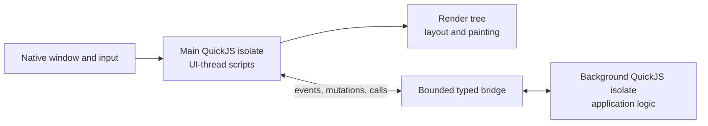

# Dual JavaScript runtime

`runtime::DualRuntime` composes two independent QuickJS isolates for a
Lynx-style UI architecture:

- The **main runtime** executes latency-sensitive JavaScript on the UI thread.
- The **background runtime** executes application logic on a dedicated OS
  thread.

The runtime crate provides isolation, scheduling, plugins, and typed channels.
It does not own native windows, the DOM, layout, or rendering. Those features
belong in host and UI plugins built on top of this crate.

## Architecture



The two runtimes do not share a JavaScript heap. Each has independent:

- globals and modules;
- plugins and runtime userdata;
- promises and microtasks;
- timers and queued macrotasks;
- JavaScript object identity and garbage collection.

An `rquickjs::Value`, `Object`, `Function`, `Promise`, or other value tied to a
QuickJS context must never cross the runtime boundary. Convert cross-runtime
data into owned Rust messages first.

## Runtime responsibilities

| Main runtime | Background runtime |
| --- | --- |
| Input and gesture handlers | Application and business logic |
| Animation callbacks | React or Solid reconciliation |
| Small, synchronous visual updates | Networking and native modules |
| Frame scheduling | Timers and asynchronous work |
| UI-thread plugin bindings | Logical DOM mutations |

The main runtime should expose a deliberately small API. Long-running main
scripts block input, layout, and painting just as long-running browser main
thread scripts do.

The background runtime is created and driven on a dedicated thread named
`burokku-js-background` by default. The name can be changed with
`background_thread_name()`.

## Creating and driving both runtimes

`DualRuntimeBuilder::build()` returns two values:

1. `DualRuntime`, which provides handles for submitting work to both isolates.
2. `DualRuntimeDriver`, which must remain continuously polled on the UI thread.

```rust
use runtime::{
    plugins::{ConsolePlugin, JsonPlugin, TimersPlugin},
    DualRuntime, Result,
};

#[tokio::main(flavor = "current_thread")]
async fn main() -> Result<()> {
    let (runtime, main_driver) = DualRuntime::builder()
        .main_plugin(ConsolePlugin)
        .background_plugin(ConsolePlugin)
        .background_plugin(JsonPlugin)
        .background_plugin(TimersPlugin)
        .main_macrotask_capacity(256)
        .background_macrotask_capacity(1024)
        .build()
        .await?;

    let application = async move {
        let main_value: i32 = runtime.main().eval("20 + 22").await?;
        let background_value: i32 = runtime.background().eval("6 * 7").await?;

        assert_eq!(main_value, 42);
        assert_eq!(background_value, 42);

        runtime.shutdown().await
    };

    let ((), result) = tokio::join!(main_driver.run(), application);
    result
}
```

The driver and application are joined because each needs the other to make
progress:

- `eval()` submits a task and waits for the main driver to execute it.
- `main_driver.run()` completes only after the runtime is shut down.
- `DualRuntime::shutdown()` must run while the main driver is still being
  polled.

`DualRuntimeDriver` is intentionally `!Send`. It cannot be moved into
`tokio::spawn` on a multi-thread executor, where it could migrate away from the
platform UI thread. Drive it directly alongside the native event-loop future,
normally with `tokio::join!`, `tokio::select!`, or a `LocalSet`.

## Installing plugins

Plugins are installed explicitly into one isolate:

```rust
let builder = DualRuntime::builder()
    .main_plugin(MainThreadEventsPlugin::new(/* host handle */))
    .background_plugin(DomPlugin::new(/* bridge endpoint */));
```

`main_plugin()` and `background_plugin()` do not install the same plugin into
both runtimes. This prevents background-only capabilities such as networking
from accidentally becoming available to main-thread scripts.

A plugin that supports multiple roles can inspect the current role during
installation:

```rust
use runtime::{rquickjs::Ctx, Plugin, Result, RuntimeRole};

struct RoleAwarePlugin;

impl Plugin for RoleAwarePlugin {
    fn install<'js>(&self, context: &Ctx<'js>) -> Result<()> {
        match RuntimeRole::from_context(context) {
            Some(RuntimeRole::Main) => {
                // Install only latency-sensitive APIs.
            }
            Some(RuntimeRole::Background) => {
                // Install application-facing APIs.
            }
            _ => {
                // Optionally support a standalone Runtime.
            }
        }
        Ok(())
    }
}
```

Plugin installation is synchronous. It should register globals, functions, or
userdata and return quickly. Long-lived asynchronous work should be spawned or
owned by the host, with results submitted through a runtime queue or bridge.

No standard plugin is installed implicitly. Capabilities such as `console`,
`JSON`, and timers must be selected using `ConsolePlugin`, `JsonPlugin`, and
`TimersPlugin` respectively.

After each macrotask and its ready QuickJS microtasks, the runtime invokes every
plugin's `checkpoint()` callback. The callback intentionally receives no
QuickJS `Ctx`: checkpoint code must not execute JavaScript or schedule QuickJS
microtasks. A plugin that needs deferred JavaScript work must submit a future
macrotask through `MacrotaskQueue`. This keeps checkpoints suitable for final
native commits such as immutable DOM publication.

## Cross-runtime communication

Use `bridge_channel()` to create a bounded, typed, bidirectional channel:

```rust
use runtime::{bridge_channel, BridgeEndpoint};

#[derive(Debug)]
enum MainToBackground {
    Event { target: u64, name: String },
    FramePresented { revision: u64 },
}

#[derive(Debug)]
enum BackgroundToMain {
    Commit { revision: u64, mutations: Vec<String> },
    RequestFrame,
}

let (main_endpoint, background_endpoint): (
    BridgeEndpoint<MainToBackground, BackgroundToMain>,
    BridgeEndpoint<BackgroundToMain, MainToBackground>,
) = bridge_channel(128);
```

Move each endpoint into the plugin or host state for its corresponding runtime.
The endpoint's sending half can be cloned with `sender()`, while its receiving
half has one owner so message order remains explicit.

Cross-runtime function calls should be represented by messages containing a
call ID, function ID, and serializable arguments. Resolve the call
asynchronously, normally as a JavaScript promise. Do not synchronously block
one runtime waiting for the other; reciprocal calls can otherwise deadlock.

For a UI engine, bridge messages will typically include stable IDs and
revisions:

```text
Background -> Main: Commit { app_id, revision, mutations }
Main -> Background: Event { window_id, target_id, revision, payload }
```

Revisions allow either side to reject stale measurements or events after a
newer UI commit has been applied.

## Bounded macrotask queues

Each isolate has a bounded macrotask queue. The default capacity is
`DEFAULT_MACROTASK_CAPACITY`, currently 1024. Configure the two queues
independently:

```rust
let builder = DualRuntime::builder()
    .main_macrotask_capacity(256)
    .background_macrotask_capacity(2048);
```

There are two submission APIs:

- `MacrotaskQueue::enqueue(task).await` waits asynchronously for capacity.
- `MacrotaskQueue::try_enqueue(task)` returns `MacrotaskQueueError::Full`
  immediately when the queue is full.

Use `enqueue()` from asynchronous producers such as timer drivers, network
tasks, and bridge pumps. Use `try_enqueue()` from synchronous JavaScript or
native event callbacks. A synchronous callback must not wait for queue
capacity, because the same isolate may need to consume the queue.

When `try_enqueue()` reports `Full`, the host must choose a policy appropriate
for the task:

- preserve ordered keyboard, button, and lifecycle events;
- coalesce cursor, resize, scroll, and redraw events to their latest value;
- reject or defer application calls that cannot be dropped;
- avoid retrying a partially submitted batch as a whole.

Shutdown uses a separate prioritized control channel. It does not wait behind a
full macrotask queue. Queued tasks that have not started are discarded during
shutdown, and their waiting callers observe cancellation.

## UI integration model

The recommended UI ownership boundary is:

1. The background runtime owns the application framework and a logical DOM or
   mutation producer.
2. A background plugin batches owned mutation messages and sends them through
   the bridge.
3. The main host applies those mutations to the authoritative render tree.
4. The main host performs hit testing, layout, painting, and presentation.
5. Input events are handled immediately by permitted main-thread scripts and/or
   forwarded to the background runtime as typed events.

Plugins expose the JavaScript-facing API, but should not move thread-affine
native resources across the bridge. Native windows, GPU surfaces, and the
platform event loop remain owned by the main-thread host.

Synchronous browser layout APIs require special care. A background call such as
`getBoundingClientRect()` cannot synchronously flush layout owned by the main
thread without blocking across runtimes. Prefer an asynchronous measurement API
or return explicitly cached geometry.

## Shutdown and failure behavior

Call `DualRuntime::shutdown()` for an orderly stop. It:

1. signals both isolates through their priority control channels;
2. waits for both event loops to acknowledge shutdown;
3. joins the dedicated background thread.

Dropping `DualRuntime` also requests shutdown, but explicit shutdown is
preferred when the application must know that the background thread and plugin
tasks have stopped.

JavaScript errors returned by `eval()` and `eval_promise()` are reported to the
caller. Errors from fire-and-forget native macrotasks are logged by the runtime.

## Current scope

`DualRuntime` is the execution foundation, not a complete Lynx implementation.
It currently does not provide:

- a compiler transform for extracting main-thread functions;
- automatic closure capture or state synchronization;
- DOM, layout, event bubbling, or rendering;
- automatic UI mutation coalescing;
- synchronous JavaScript function transfer between isolates.

Those capabilities should be layered on top using role-specific plugins and
owned bridge messages while keeping the two QuickJS heaps isolated.
