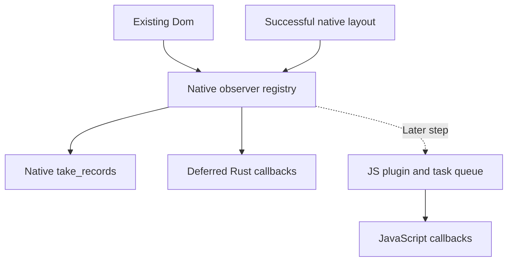

# Native ResizeObserver API and JavaScript bridge proposal

Status: steps 1–3 are approved and committed as `fd282cabd`, `8131c2bcd`, and
`dd52d117e`. Step 4 is approved: JS registration, traced
callback/target ownership, and immutable entries delegate to the native core.
Installation and delivery hooks are tested directly; automatic JS task scheduling
and application/plugin installation remain later steps.

## Feasibility and recommendation

Implement resize observation as a native Rust API backed by the layout engine,
then expose JavaScript `ResizeObserver` through a thin plugin adapter in
`crates/burokku/src/plugins/resize_observer.rs`. Rust consumers must be able to
register observers and receive measurements without installing a JavaScript plugin
or creating a QuickJS context. This covers direct style changes, changes caused
by parents or siblings, text reflow, and native window resizing.

The native service owns observation semantics: registrations, layout sizes,
measurement, change detection, batching, and registration generations. The JS
adapter owns argument conversion, callback and wrapper retention, entry creation,
and JavaScript task scheduling. Both Rust and JavaScript consumers use the same
native service; neither the host nor the adapter duplicates its registry.

Observe Burokku's `window` element to track the native window's inner viewport.
Observe its descendants to track whichever of their sizes actually change during
that resize. A fixed-size child should not notify merely because the window resized.

The browser API observes elements; browser viewport notifications otherwise use a
window resize event. Burokku already represents its native window as an element,
so the proposed API uses that existing target. See the
[Resize Observer specification](https://drafts.csswg.org/resize-observer/#resize-observer-interface).

The current scope observes only the existing layout width and height in logical
pixels. Content-box/border-box selection is deferred; keep only a TODO until the
required style behavior is implemented. Native callbacks are deferred to the host
event-loop phase.
Browser-equivalent delivery before painting is a separate, larger render-loop change.

## Existing integration points

| Location | Relevant behavior today |
| --- | --- |
| `plugins/resize_observer.rs` | Still empty; public plugin wiring is deferred to step 6. |
| `ui/js_bindings/resize_observer.rs` | JS constructor and registration methods, traced callback/target roots, immutable entries, and a controlled delivery hook; no automatic task scheduling yet. |
| `ui/resize_observer.rs` | Native subscriptions, layout-size measurements, prepared batches, native callbacks, record consumption, and registration lifetimes; contains no QuickJS values. |
| `plugins/dom.rs` and `app.rs` | `DomPlugin` owns shared DOM bindings; `Burokku::run` wires them to the host and runtime without an observer plugin. |
| `ui/layout/engine.rs` | Computes and caches layouts by DOM revision, viewport, and text generation; publishes successful layouts to the native observer registry. |
| `ui/layout/computed.rs` | Exposes per-node Taffy layout sizes, used directly by the observer. |
| `ui/layout/reconcile.rs` | Forces the window root's layout size to the logical viewport. |
| `ui/host/events.rs` | Resize/scale events measure before GPU checks; `about_to_wait` handles requested measurements and deferred native callbacks. |
| `ui/host/render.rs` | `measure_layout` computes independently of GPU resources; redraw measures before resize/presentation and reuses that layout for the scene. |
| `ui/js_bindings.rs` | Publishes presented geometry for `getBoundingClientRect()`. |
| `runtime::JsTaskQueue` | Runs native-scheduled JavaScript work as macrotasks, followed by microtasks. |

Completed layout computations publish native observation snapshots. Both redraw
and native resize/scale events call the host measurement method before GPU work.
New observations and DOM mutations with active registrations request host work
through the existing event-loop waker. Requests coalesce until measurement runs.
Successful layout publication schedules native callback delivery without invoking
user code inside layout computation.

## Native Rust API

The existing `Dom` already works without a JavaScript context. Keep its ownership
and mutation API. `ui::resize_observer` implements observation directly against
that DOM; there is no new document wrapper or replacement element-handle system.

The implemented callback API is:

```rust
// `dom` and `panel` come from the existing native application DOM.
let observer = dom.resize_observer();
observer.set_callback(|entries| {
    for entry in entries {
        println!("{:?}: {} x {}", entry.target, entry.size.width, entry.size.height);
    }
})?;
observer.observe(&dom, panel)?;
// Keep `observer` alive while watching the panel.

// Later: observer.unobserve(panel), observer.disconnect(), or drop(observer).
```

`set_callback` accepts `FnMut(&[ResizeObserverEntry]) + 'static` without `Send`.
The host invokes it after successful measurement, outside DOM and registry borrows. A DOM borrow conflict during native delivery is an
invariant violation and panics with context; delivery does not return a host error.
Replacing a callback invalidates any prepared delivery for the old callback. Each
host phase snapshots eligible registrations before invoking user code; changes made
by callbacks request another measurement turn rather than recursive delivery.

Without a callback, native consumers can keep using `take_records(&dom)`. It
explicitly consumes pending records and never computes layout or invokes user code.
It returns an empty batch before a successful layout or when the DOM revision has
advanced beyond the latest layout. Manually consuming records also consumes them
for that observer's callback; the two mechanisms share the same delivery state.

A compilable native usage example is included in `ResizeObserver::set_callback`'s
Rust documentation. It accepts the existing `Dom` and returns the owned subscription.

| Type or operation | Contract |
| --- | --- |
| `Dom::resize_observer()` | Creates an owned native subscription in this DOM's registry. |
| `ResizeObserver::observe(&Dom, NodeId)` | Validates the element, then adds or replaces a registration. |
| `set_callback(F)` | Installs or replaces a native callback and requests a host check for active registrations. |
| `unobserve(NodeId)` / `disconnect()` | Idempotent cancellation; disconnect leaves the observer reusable. |
| `take_records(&Dom)` | Returns changed native records from the latest successful layout and advances only this observer's reported sizes. |
| `ResizeObserverEntry` | Target `NodeId` and `size: taffy::geometry::Size<f32>` with width and height in logical pixels. No custom size/rect type or box-selection enum. |
| `ResizeObserverError` | Closed observer or invalid/stale/non-element target. |

The registry belongs to the existing `Dom`. Observer handles refer to it weakly;
dropping the DOM or shutting down its host closes them. Registrations retain detached components through the
existing reclamation routine, alongside live wrapper roots. Returned records carry
non-owning node IDs and do not extend target lifetime after cancellation.

The application has one DOM arena and its layout engine stays with that DOM.
`NodeId` supplies node identity and generation checking. There is no separate DOM
identity or cross-document validation. The JS adapter validates that an argument is
an element wrapper before extracting its node ID.

The internal prepare/commit interface separates entry construction from consumption.
Preparing or dropping a batch does not advance reported sizes. Commit checks the
observer identity, registration generations, current DOM revision, and latest layout
snapshot. An invalidated batch is discarded without consuming valid pending changes.
The future JS adapter can therefore construct entries before committing, and native
callback delivery uses the same mechanism and invokes user code after releasing
DOM and registry borrows.



## JavaScript binding API

The following bindings are implemented behind the crate-owned installation hook.
They are not installed by `Burokku::run` yet, and no automatic JS delivery task is
scheduled in step 4. Tests install them after `DomPlugin`, publish native layouts,
and invoke the delivery hook explicitly.


```js
const win = app.createElement('window');
const panel = app.createElement('div');
panel.style.setProperty('width', '50%');
panel.style.setProperty('height', '120px');
win.appendChild(panel);
app.appendChild(win);

const observer = new ResizeObserver((entries, observer) => {
  for (const entry of entries) {
    const { width, height } = entry.size;
    console.log(entry.target === win ? 'window' : 'panel', width, height);
  }
});

observer.observe(win);
observer.observe(panel);

// Later:
// observer.unobserve(panel);
// observer.disconnect();
```

Implemented entry shape:

```ts
interface ResizeObserverEntry {
  readonly target: BurokkuElement;
  readonly size: { readonly width: number; readonly height: number };
}
```

This is a Burokku layout-size API, not a complete browser ResizeObserver entry
shape. Use immutable snapshot records, and preserve the canonical existing element
wrapper as `entry.target`. Do not expose separate content/border fields or a rect.

Only elements belonging to the plugin's DOM are accepted. Reject `app`, raw text
nodes and unrelated objects with `TypeError`.
Accept `text` elements, but only elements that produce their own layout box can
produce a nonzero measurement; inline text folded into a paragraph has no separate box.
Box options are not supported in this version. Add them only with the future
content-box/border-box work, not as placeholder bindings.

## Measurement and notification rules

- Read width and height directly from the final layout result, not declared style
  values or overflow content extents. Padding is already included in that size.
- Use logical pixels without rounding. Do not calculate separate content/border
  measurements or introduce rect metadata in this version.
- The window's layout size represents the inner viewport, excluding OS title bar
  and outer window decorations. Derive it from actual native inner size and scale,
  not requested window style dimensions.
- Deliver one initial asynchronous measurement for an attached target after a
  successful layout, including an attached zero-size target. Observing an already
  laid-out element must schedule a check even when the DOM revision is unchanged.
- Deliver again only when the layout width or height changes. Compare canonical
  finite layout values directly; normalize negative zero. Position and paint-only
  changes do not trigger notifications.
- Repeated `observe(target)` replaces the registration and requests a
  fresh initial measurement. `unobserve` and `disconnect` are idempotent; an observer
  remains reusable after `disconnect`.
- Batch changed targets once per observer per delivery. Coalesce intermediate
  layouts to the latest available snapshot; this API does not record every step
  of a native resize drag.
- An initially detached target waits for attachment. A previously measured target
  that becomes detached or loses its box transitions to a zero measurement once,
  when that differs from the last reported size. Keep the registration for reattachment.
- A scale-factor change triggers measurement again. If logical box sizes are
  unchanged, no size notification is needed.

The initial-zero and initially-detached policies above are deliberate Burokku v1
choices. The broader API is a supported subset, not a claim of complete browser conformance.

## Ownership and host integration

Keep one native observer registry on the existing `Dom` and connect it to the
host's layout lifecycle. Rust consumers create subscriptions directly from that DOM.
Keep its state outside `ui/js_bindings`: native registrations, measurements,
generations, pending batches, and last-delivered sizes must not
require QuickJS types or JavaScript installation.

Retain `ResizeObserverPlugin` as the JS adapter. Register it automatically after
`DomPlugin` in `Burokku::run`, connecting both to the same native document and
observer service. Standalone JavaScript runtimes explicitly pair it with an
existing `DomPlugin`. The internal binding installer resolves the existing DOM
from the installed `app` wrapper; it accepts no separate document or arena identity. Standalone usage still needs
a native layout driver; installing plugins does not create one.

Keep JavaScript bindings in `ui/js_bindings/resize_observer.rs` so they can reuse
internal node validation and wrapper identity. Its traced registry maps native
observer/registration identities to callbacks and canonical target wrappers. It
must not own a second copy of previous sizes, or change detection.

Extract a host measurement step from the rendering-only path:

1. Schedule it on DOM changes, native size/scale changes, or a new observation
   from either Rust or JavaScript.
2. Compute the current layout using the actual logical viewport, reusing the cache
   when valid. Process disconnected targets even when no box exists for them.
3. Publish an immutable observation snapshot to the native service only after
   layout succeeds. Rendering can reuse that computed layout. Do not advance
   observations on failed layout.
4. Request deferred delivery for observers with work. Native observers use the
   host delivery phase; the JS adapter enqueues at most one delivery task for its
   pending observers. Merely scheduling work does not mark measurements delivered.
5. At delivery, ask the native service to prepare current changes. Revalidate
   registration generations, commit delivered sizes immediately before each
   callback, and release all Rust borrows before invoking user code.
6. Let callback mutations request the next host layout turn. Never recursively
   compute layout or invoke another resize callback on the current callback stack.

If the document revision has moved beyond the published layout before delivery,
request a fresh host measurement instead of combining that layout with newer DOM
state. Recheck eligibility between callbacks, since an earlier callback can mutate
the DOM or invalidate another observer's pending registrations.

This step must also run when the native surface is zero-sized or cannot present;
otherwise minimization and GPU failures would suppress valid measurements. The
existing `LogicalViewport` already permits zero dimensions. A zero-size native
viewport does not imply every descendant is zero: fixed-size children can remain
larger than it. If the OS minimizes without changing inner size, no resize is reported.
Removing the final window currently shuts down the app; final callbacks are not
guaranteed during shutdown.

Keep the existing presented-layout state used by hit testing and
`getBoundingClientRect()` separate. Observer entries describe the measured layout;
that layout may not yet have been presented, so those reads can temporarily differ.

## Scheduling, lifetime, and errors

Native delivery runs through the host and works without a JS runtime. Rust and JS
observers share measurement rules, but their delivery schedulers can run at
different times; no relative ordering between Rust and JS callbacks is promised.

For the JS adapter, `JsTaskQueue` closures require `Send`. Queue a delivery signal
that resolves context-owned state when executed; do not capture `Rc`, borrowed layout state,
or QuickJS values inside the queued closure.

On a full JS queue, retain the latest snapshot in the native service and use one
pending asynchronous enqueue waiter. Do not mark sizes delivered or silently lose the final resize.
On queue closure, discard pending work during shutdown. New observations need a
host wakeup independent of DOM revision changes, including when no redraw is pending.

Before each callback, the native service revalidates registration generations and
node identity so `unobserve`, `disconnect`, or re-observation can invalidate pending entries.
Update last-delivered sizes immediately before invocation, after adapter entry
construction succeeds. A failed entry conversion must not consume the native batch.
Report a JavaScript callback exception and continue with other observers; it must
not become a fatal host error. Rust callback panics follow the host's normal panic
policy; this API does not introduce a panic-isolation guarantee.

Native registrations retain their target's detached DOM component. The existing
reclamation routine now includes registered targets alongside wrapper roots.
Unobserving, disconnecting, dropping a Rust observer handle, or destroying the
service releases those roots. Explicit native subtree destruction can still
invalidate targets; cancel affected registrations and discard pending entries for
those generations rather than accessing stale nodes. Detachment alone does not
cancel observation.

The JS adapter additionally keeps callbacks and canonical target wrappers in
QuickJS-traced storage. Active JS observations retain their JS observer and its
native subscription; removing registrations releases active retention. An
unreferenced JS observer with no targets can be collected. Runtime teardown drops
JS-owned subscriptions and retained values, without canceling independently owned
Rust observers if the native document/host remains alive. Host/document teardown
cancels all observers and delivery signals. Native service ownership must not form
a strong cycle through callbacks and observer handles; use weak internal links and
explicit cancellation. Validate element wrappers before extracting generational `NodeId` keys, and
revalidate those keys at delivery.

Delivery is asynchronous and is not guaranteed before paint. Callback-driven size
changes may appear on the next frame. One delivery per host measurement turn
prevents synchronous recursion, but an application that alternates sizes forever
can still animate forever. Browser depth-based resize-loop handling and its error
semantics are deferred; they require coordinated layout/delivery phases before paint.

## Implementation scope after review

| File or area | Planned change |
| --- | --- |
| `crates/burokku/src/ui/resize_observer.rs` | Native core implemented; deferred callback delivery remains. |
| `crates/burokku/src/ui.rs` | Export the native observer module. |
| `crates/burokku/src/ui/elements.rs` | Existing `Dom` owns the registry; observation roots join existing reclamation. No document ownership refactor. |
| `crates/burokku/src/plugins/resize_observer.rs` | Thin JS plugin installation and connection to the existing native service. |
| `crates/burokku/src/app.rs` | Connect callback delivery and the JS adapter to the existing DOM registry. |
| `crates/burokku/src/ui/js_bindings/resize_observer.rs` | JS argument conversion, traced callback/wrapper mappings, task scheduling, and entry construction; delegate observation semantics to the native service. |
| `crates/burokku/src/ui/js_bindings.rs` | Expose the existing native registry to the adapter and validate element wrappers before extracting node IDs. |
| `crates/burokku/src/ui/layout/computed.rs` | Use the existing layout size directly; no new content/border measurement helper. |
| `crates/burokku/src/ui/host/*` | Measurement scheduling, native resize integration, and lifecycle cleanup. |
| `packages/runtime/src/index.ts` | Matching exported types and global constructor declaration. |

No timers, polling-based size checks, generic plugin framework changes, device-pixel
box support, or separate window resize event are needed for this version.

## Small implementation steps and review checkpoints

The user corrected the approach: implement against the existing `Dom`, without a
new document wrapper or a preliminary documentation-only step. The first code
checkpoint below replaces that earlier plan. At the end of every step, present the
changed files, behavior, verification results, and remaining limitations, then stop
for explicit user review. Do not start the next step until the user approves.

### Step 1 — Native observer core (approved; committed as `fd282cabd`)

Deliverable: native `ResizeObserver` subscriptions on the existing `Dom`, using
existing `NodeId`s. Implement observe/unobserve/disconnect, layout sizes, initial
and changed records, batch preparation/commit, and drop cancellation. Publish
successful layouts and include observation roots in existing DOM reclamation.
Remove the unnecessary document wrapper.

Check: native tests cover idle initial observation, zero sizes, padding and position changes that leave size unchanged, viewport and percentage-child resizing,
coalescing, stale layouts, detach/reattach, cancellation, explicit destruction,
invalid-target rejection and failed-layout recovery without QuickJS.

Verification: `cargo test -p burokku --lib` passed all 180 library tests, including
10 native observer tests. The deferred content-box helper and its test were removed.

Boundary: consumers explicitly take records. Automatic callbacks, observation
wakeups, and measurement independent of redraw are not implemented yet.

**Review checkpoint:** review the native core before changing host scheduling.

### Step 2 — Separate host measurement from presentation (approved; committed as `8131c2bcd`)

Deliverable: extract successful layout measurement from the redraw-only path while
preserving cache reuse and presented geometry. Permit measurement when presentation
fails or the native surface is zero-sized.

Check: rendering and presented geometry remain correct; failed layouts preserve
previous state; zero-size viewports can still contain fixed-size children.

Implementation: `ApplicationHost::measure_layout` in `ui/host/render.rs` returns
the existing shared computed layout without publishing presented geometry. Redraw
uses it before GPU resize and the zero-size early return; resize/scale events use
it before the pending-GPU early return. Scene construction reuses the same snapshot.

Verification: `cargo test -p burokku --lib` passed all 184 tests. Four host regression
tests cover cache reuse without GPU resources, unchanged presented geometry, zero
viewports with fixed-size children, a scene target too large to present, and failed
layout preserving previous state until a successful retry. Formatting and whitespace
checks passed. Actual macOS drag/minimize testing remains in the final verification
step; this step adds no callbacks or observation-triggered wakeups.

**Review checkpoint:** approved; committed as `8131c2bcd`.

### Step 3 — Native wakeups and deferred callbacks (approved; committed as `dd52d117e`)

Deliverable: connect DOM/native size/scale changes and new observations to host
measurement. Add deferred native callback delivery using prepare/commit, releasing
all borrows before user code. Add a small native example using the existing DOM.

Check: idle observations request work, callbacks can mutate the DOM and registrations,
stale work waits for remeasurement, and handle/host teardown cancels pending work.

Implementation: `set_callback` stores native callbacks on the existing registry.
DOM mutations and new registrations request one pending measurement through a
standard Rust `Waker` backed by the existing event loop. Successful layouts mark
native delivery pending; `about_to_wait` measures requested work and then dispatches
prepared callbacks. Callback-driven changes wake a later turn. Failed measurements
clear pending work without advancing reported sizes or busy-retrying the failure.
Host exit/drop clears subscriptions and releases callbacks. The host keeps a shared
handle to the same registry so cleanup does not require borrowing the DOM.

Verification: all 191 library tests pass, including seven new callback/wakeup
regressions. These cover idle cache reuse, coalesced wakeups, DOM mutation during a
callback, invalidation of later callbacks, callback replacement, cancellation after
preparation, and host teardown while the DOM is borrowed. The native usage doctest
also passes. After changing delivery borrow conflicts to invariant panics, all 37
host tests pass, including the new expected-panic regression. Formatting and
whitespace checks pass. Manual macOS window testing
remains in the final verification step; no JS binding has been added here.

**Review checkpoint:** approved. JavaScript adapter work remains the next step.

### Step 4 — JavaScript registration and entry bindings (approved)

Deliverable: implement JS registration as an adapter over native subscriptions.
Keep callbacks and canonical target wrappers in traced JS storage; convert immutable
entries and delegate generations and change detection to Rust.

Check: target ownership, unsupported options, wrapper identity, entry shape,
re-observation, disconnect, and GC retention/release using controlled delivery tests.

Implementation: `ui/js_bindings/resize_observer.rs` defines the JS constructor and
`observe`, `unobserve`, and `disconnect`. Its traced registry retains active JS
observers; each observer retains its callback and canonical target wrappers plus
one native subscription. It duplicates no native sizes or registration generations.
The delivery hook snapshots native batches and JS targets, constructs immutable
`{ target, size: { width, height } }` entries, then asks the native core to commit
before invoking callbacks with all binding borrows released. An invalidated batch
is skipped; entry-construction failure leaves it unconsumed. Callback exceptions
are reported without suppressing other observers. Explicit native destruction
releases stale adapter roots at the next delivery check.

Verification: all 10 adapter tests pass. They cover installation requirements,
argument validation and unsupported options, canonical wrappers and immutable
layout sizes, cancellation/re-observation between callbacks, conversion failure,
callback exceptions, active/passive GC lifetimes, per-target unobserve, native
subtree destruction, and runtime teardown preserving independent native observers.
The teardown test drops the actual QuickJS runtime, whose class-prototype storage
outlives individual contexts. Formatting and whitespace checks pass.

Boundary: installation/delivery remain internal hooks exercised directly by tests.
Automatic native-to-JS queue signaling belongs to step 5, and public plugin plus
application installation belongs to step 6.

**Review checkpoint:** approved. Step 5 is authorized.

### Step 5 — JavaScript task delivery

Deliverable: connect native delivery signals to `JsTaskQueue`, retaining one pending
task and one saturation waiter per adapter. Construct entries before committing;
isolate callback exceptions and clean up on queue closure or runtime teardown.

Check: saturated queues eventually deliver the latest size after the host goes idle;
failed entry construction preserves pending changes; stale registrations do not fire;
slow JS delivery does not block native consumers.

**Review checkpoint:** review asynchronous delivery, retry behavior, and cleanup.

### Step 6 — Application wiring and TypeScript declarations

Deliverable: implement plugin pairing and automatic installation in `Burokku::run`,
export matching runtime types, and document standalone runtime use with a native
layout driver. Both native and JS consumers use the same DOM registry.

Check: plugin installation failures, TypeScript usage, independent native/JS
subscriptions, and runtime teardown with surviving native ownership where supported.

**Review checkpoint:** review the complete public integration.

### Step 7 — End-to-end verification and examples

Deliverable: verify remaining checklist scenarios and manually drag-resize and
minimize/restore the macOS example. Record actual native sizes and callback counts,
and update documentation to reflect the reviewed implementation.

Check: relevant project checks pass, checklist scenarios have evidence, and timing
limitations are accurate. Broader fixes return for review before implementation.

**Review checkpoint:** present the feature and verification evidence for final review.

## Verification after implementation

First test the native service and host delivery without creating a QuickJS context.
Then test the JS adapter against the same native behavior. Cover these transitions:

1. Initial observation after an idle layout; multiple targets batched; unchanged
   size and position-only edits produce no duplicate notification.
2. Direct style resize, parent resize, and text wrapping update the appropriate
   targets; padding and position changes without layout-size changes stay quiet.
3. Native viewport resize updates the window and percentage-sized children while
   a fixed-size child stays quiet; scale changes preserve logical-pixel semantics.
4. Zero viewport and failed presentation still allow successful layout measurements;
   failed layout preserves the previous delivered sizes.
5. Queue saturation followed by an idle host eventually delivers the latest size.
6. Disconnect/re-observe before delivery, detach/reattach, and callback mutations
   do not deliver stale registrations or cause borrow conflicts.
7. One throwing JS callback does not suppress another observer; GC and shutdown
   release observer/target roots without stale-node access.
8. A Rust-only observer receives initial and changed sizes without JS installation;
   dropping its handle cancels pending delivery and releases native target roots.
9. Rust and JS observers coexist on the same target with independent registrations
   and delivery state; disconnecting one does not affect the other.
10. Invalid targets are rejected; explicit subtree destruction invalidates pending
    entries safely.
11. JS queue saturation does not block native callbacks or advance JS delivery
    state; failed JS entry construction leaves its batch available for retry.
12. Rust callbacks can mutate the DOM or cancel another observer without retained
    borrows or recursive delivery; pending stale-layout batches wait for remeasurement.
13. JS runtime teardown releases only JS-owned subscriptions when the native host
    survives; native host teardown releases all observers without ownership cycles.

Finally, manually drag-resize and minimize/restore a macOS example. Verify actual
native inner-size changes and callback counts rather than relying on render screenshots.

## Review decisions

The proposed architecture is a public native Rust observer API with one registry
per document, host-driven measurement, deferred native delivery, and a thin JS
plugin using `JsTaskQueue`. Rust consumers can observe without QuickJS. Automatic
installation applies only to the JS adapter in `Burokku::run`.

Review the native subscription API on the existing `Dom`, target-retention and
cancellation rules, and the shared prepare/commit delivery contract. The measurement
scope uses the existing `window` element for viewport size and a single layout-size
measurement. Content/border box selection remains future work. Callback timing remains asynchronous after successful layout, without a
before-paint guarantee; requiring browser-equivalent timing expands the scope into
a render-loop project.

Implementation follows the steps and mandatory review checkpoints above. Step 1
through step 3 are committed; step 4 is approved. Step 5 is authorized and will
stop for review when complete.
